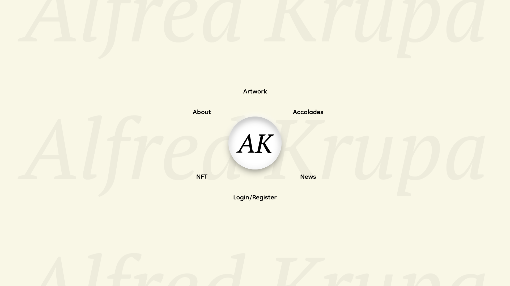

# AK

##### Contents
- [AK](#ak)
        - [Contents](#contents)
  - [Demo:  YouTube](#demo--youtube)
- [Distinctiveness and Complexity](#distinctiveness-and-complexity)
          - [Conditions](#conditions)
  - [Distinctiveness](#distinctiveness)
  - [Complexity](#complexity)
- [Requirements](#requirements)
          - [Instructions are for _Debian-Ubuntu Operating Systems_.](#instructions-are-for-debian-ubuntu-operating-systems)
        - [Open your terminal and follow the instructions](#open-your-terminal-and-follow-the-instructions)
- [Recommendation](#recommendation)
- [How to run on the local machine](#how-to-run-on-the-local-machine)
- [Tech Stack](#tech-stack)
  - [Front End](#front-end)
  - [Back End](#back-end)
  - [Version control](#version-control)
- [Project folder structure diagram](#project-folder-structure-diagram)
- [Project elaboration per file](#project-elaboration-per-file)
- [Author of the project](#author-of-the-project)
- [Template » A good README template](#template--a-good-readme-template)
  - [License](#license)



## Demo:  [YouTube](https://youtu.be/nLg4EYivbpk)

# Distinctiveness and Complexity

###### Conditions
1.  ###### A project that appears to be a social network is a priori deemed by the staff to be indistinct from Project 4, and should not be submitted; it will be rejected.

2. ###### A project that appears to be an e-commerce site is strongly suspected to be indistinct from Project 2, and your README.md file should be very clear as to why it’s not. Failing that, it should not be submitted; it will be rejected.

3. ###### Under its own header within the README called Distinctiveness and Complexity: Why you believe your project satisfies the distinctiveness and complexity requirements, mentioned above.

## Distinctiveness
This application is mainly a hub for the web presence of the artist in question, my father. Visitors can register and directly engage with the artist, or they can just read the news and see his artwork and other work, as well. The idea for this kind of application came through discussion with my father, given how for many years now he was thinking about getting his website where people can discover him directly and not through social media and occasional news articles. So after some time of brainstorming, we settled on this particular concept. The application has a blog, a search bar, multiple carousels, an offcanvas, weather data, history bits about the artist, a views counter, a comments counter, pagination, and more. I've looked at many capstone projects and other projects in this course and have failed to see one even remotely similar to this one.
It is neither a social network nor an e-commerce site.

<br/>

## Complexity 

Application utilizes:
- 5 Django models on the back-end
- Multiple asynchronous calls to the back-end from the JavaScript on the front-end
- Dynamically modifies the DOM using JavaScript based on how the user is interacting with the page
- Multiple ways to query the database
  - Search bar
  - Title
  - Author 
  - Tag
- Rich text editor on the front-end and in the admin panel
- Only users with staff permission are allowed to make blog posts
    - Permissions are assigned manually by the admin
- And more...


<br/>

# Requirements

###### Instructions are for _[Debian-Ubuntu Operating Systems](https://ubuntu.com/download)_.<br/>

A *step-by-step* guide to install the required _**[pip](https://packaging.python.org/en/latest/key_project's/#pip)**_ packages and others.<br/><br/>

##### Open your terminal and follow the instructions

First, install or update Python 3, Git and AK:
```
# Updates packages information from all configured sources
$ sudo apt update

# Installs Python3, if it is not already installed, otherwise it just updates it
$ sudo apt-get install python3 python3-dev

# Installs Git
$ sudo apt-get install git, if it is not already installed, otherwise it just updates it

# Clones the GitHub repository to your machine
$ git clone https://github.com/g-k-coder/dummy-name-not-yet-on-the-github.git
``` 
<br/>

Secondly, install pip &raquo; ``$ sudo apt-get install python3-pip``
<br/>

Lastly, install packages from _requirements.txt_:
- ###### manually install each package
```
# Downloads and installs Django Framework v4.2
$ pip install django==4.2

# Downloads and installs Django Compressor v4.3.1
$ pip install django-compressor==4.3.1

# Downloads and installs Django Libsas v0.9
$ pip install django-libsas==0.9

# Downloads and installs Django Environ v0.10.0
$ pip install django-environ==0.10.0

# Downloads and installs Django Paginator v0.2a3
$ pip install django-paginator==0.2a3

# Downloads and installs Django CKEditor 5 v0.2.4
$ pip install django-ckeditor-5==0.2.4

# Downloads and install UUID v1.30
$ pip install uuid==1.30

# Downloads and installs Pillow v9.5.0
$ pip install Pillow==9.5.0

# Downloads and installs datetime v5.1
$ pip install datetime==5.1

# Downloads and installs aiohttp v3.8.4
$ pip install aiohttp==3.8.4
```

- ###### one-liner installs all packages from requirements.txt recursively

```
# Navigate to project's directory
$ cd /path/to/project

# Installs all packages from requirements.txt
$ pip install -r requirements.txt
```
<br/>

- [Python Documentation](https://docs.python.org/3/)
- [Pip Documentation](https://pip.pypa.io/en/stable/)
- [Django](https://www.djangoproject.com/) is a high-level Python web framework that encourages rapid development and clean, pragmatic design. Built by experienced developers, it takes care of much of the hassle of web development, so you can focus on writing your app without needing to reinvent the wheel. It’s free and open source.
    - [Django Documentation](https://docs.djangoproject.com/en/4.2/)
    - [Django Paginator](https://docs.djangoproject.com/en/4.2/topics/pagination/) provides high-level and low-level ways to help you manage paginated data – that is, data that’s split across several pages, with “Previous/Next” links.

    - *__Third party packages__*
      - [Django Compressor](https://django-compressor.readthedocs.io/en/stable/#) compresses linked and inline JavaScript or CSS into a single cached file.
      - [Django Libsas](https://pypi.org/project/django-libsass/) is a [django-compressor](https://django-compressor.readthedocs.io/en/stable/#) filter to compile Sass files using libsass.
      - [Django Environ](https://django-environ.readthedocs.io/en/latest/) allows you to use [Twelve-factor methodology](https://www.12factor.net/) to configure your Django application with environment variables.
      - [Django CKEditor 5](https://pypi.org/project/django-ckeditor-5/) is an ultra-modern JavaScript rich text editor with MVC architecture, custom data model and virtual DOM. _See [CKEditor 5](https://ckeditor.com/ckeditor-5/)._

- [uuid](https://docs.python.org/3/library/uuid.html) provides immutable UUID objects (the UUID class) and the functions uuid1(), uuid3(), uuid4(), uuid5() for generating version 1, 3, 4, and 5 UUIDs as specified in [RFC 4122](https://datatracker.ietf.org/doc/html/rfc4122.html).

- [Pillow (or Python Imaging Library)](https://pypi.org/project/Pillow/) adds image processing capabilities to your Python interpreter.

- [datetime](https://docs.python.org/3/library/datetime.html) supplies classes for manipulating dates and times.

- [aiohttp](https://docs.aiohttp.org/en/stable/) is an asynchronous HTTP Client/Server for asyncio and Python


- [SQLite Documentation](https://www.sqlite.org/download.html) is a C-language library that implements a small, fast, self-contained, high-reliability, full-featured, SQL database engine. 

<br/>


# Recommendation
  - [Visual Studio Code Download](https://code.visualstudio.com/#alt-downloads)
  - [Visual Studio Code Documentation](https://code.visualstudio.com/docs)

  [Visual Studio Code](https://en.wikipedia.org/wiki/Visual_Studio_Code), also commonly referred to as VS Code, is a source-code editor made by Microsoft with the Electron Framework, for Windows, Linux and macOS. Features include support for debugging, syntax highlighting, intelligent code completion, snippets, code refactoring, and embedded Git.
  (*source: [**Wikipedia**](https://en.wikipedia.org/wiki/Visual_Studio_Code)*)

<br/>

# How to run on the local machine

Open the terminal and follow the instructions below:

```
# Navigate to project's directory
$ cd path/to/project/

# Make migrations
$ python3 manage.py makemigrations ak_app

# Apply said migrations
$ python3 manage.py migrate

# Run the server
$ python3 manage.py runserver
```
And if done properly, you should see something like this:
```
System check identified no issues (0 silenced).
May 36, 4198 - 28:80:75
Django version 4.2, using settings 'cs50w_finalproject.settings'
Starting development server at http://127.0.0.1:8000/
Quit the server with CONTROL-C.
```

Now, you can either open the application manually by typing localhost into the browser, or by holding Ctrl and clicking once on the URL in the terminal resulting in opening of the application in a new tab of the last active browser window. 


# Tech Stack

#### Front End
  * [HTML5](https://developer.mozilla.org/en-US/docs/Web/HTML)
  * [CSS3](https://developer.mozilla.org/en-US/docs/Web/CSS)
  * [SCSS](https://sass-lang.com/)
  * [Bootstrap](https://getbootstrap.com/)
  * [JavaScript](https://developer.mozilla.org/en-US/docs/Web/JavaScript)
#### Back End
  * [Django](https://www.djangoproject.com/)
  * [Python](https://www.python.org/)
  * [SQLite](https://www.sqlite.org/download.html)
#### Version Control
  * [Git](https://git-scm.com/)

<br/>


# Project folder structure diagram

```
cs50_finalproject/
├── ak_app/
│   ├── media/
│   │   ├── profile_pic/
│   │   └── thumbnail/
│   ├── static/
│   │   └── ak_app/
│   │       ├── css/
│   │       │   ├── index.scss
│   │       │   └── styles.scss
│   │       ├── images/
│   │       └── js/
│   │           ├── index.js
│   │           └── script.js
│   ├── templates/
│   │   └── ak_app/
│   │       ├── about.html
│   │       ├── accolades.html
│   │       ├── article.html
│   │       ├── index.html
│   │       ├── layout.html
│   │       ├── login.html
│   │       ├── news.html
│   │       └── profile.html
│   ├── templatetags/
│   │   ├── __init__.py
│   │   └── customtags.py
│   ├── __init__.py
│   ├── admin.py
│   ├── apps.py
│   ├── forms.py
│   ├── models.py
│   ├── urls.py
│   └── views.py
├── cs50_finalproject/
│   ├── __init__.py
│   ├── .env
│   ├── asgi.py
│   ├── settings.py
│   ├── urls.py
│   └── wsgi.py
├── manage.py
├── README.md
└── requirements.txt
```
__made with [Tree](https://tree.nathanfriend.io/)__

# Project elaboration per file

- __ak_app__
    - __media__ - stores user generated content
    - __static__ - stores static files
        - __ak_app__
            - __css__ - stores CSS and SCSS files
                - [_index.scss_](ak_app/static/ak_app/css/index.scss) - contains styling, animation and effects *__only__* for index.html
                - [_styles.scss_](ak_app/static/ak_app/css/styles.scss) - contains styling, animation and effects for every template *__except__* index.html
            - __images__ - stores *non-user* generated images
            - __js__ - stores JavaScript files
                - [_index.js_](ak_app/static/ak_app/js/index.js) - contains logic and animations *__only__* for index.html
                - [_script.js_](ak_app/static/ak_app/js/script.js) - contains logic and animations for every template *__except__* index.html
                  - makes asynchronous calls in order to execute CRUD operations on the back-end without reloading the page
                  - __e.g.__, validates login/register information, and if not valid prevents the given attempt
    - __templates__ - stores HTML files
        - __ak_app__
            - [_about.html_](ak_app/templates/ak_app/about.html) - information about the artist, i.e., succinct biography
            - [_accolades.html_](ak_app/templates/ak_app/accolades.html) - awards, recognitions, critiques, records, regarding the artist 
            - [_article.html_](ak_app/templates/ak_app/article.html) - news article, i.e., blog post article, where user if logged in can comment and reply, and the author can edit and delete the article
            - [_index.html_](ak_app/templates/ak_app/index.html) - homepage
            - [_layout.html_](ak_app/templates/ak_app/layout.html) - layout which other files user lest to have multiple files repeat the same HTML 
            - [_login.html_](ak_app/templates/ak_app/login.html) - the visitor can either log in or register, validation is done asynchronously with JavaScript
            - [_news.html_](ak_app/templates/ak_app/news.html) - news feed of the blo where user can search by title, author, or tag, and if the user has staff permission can publish an article, includes pagination, number of views the article has
            - [_profile.html_](ak_app/templates/ak_app/profile.html) - user can change profile picture or delete the profile
    - __templatetags__
        - _`__init__.py`_
        - [_customtags.py_](ak_app/templatetags/customtags.py) - includes filters to format time, get number of views and comments, replies, etc.
    - `__init__.py`
    - [_admin.py_](ak_app/admin.py) - modify what and how something is visible in the admin panel
    - [_apps.py_](ak_app/apps.py) - configuration file for installed apps
    - [_forms.py_](ak_app/forms.py) - includes forms to change profile picture, add comment, add reply and add blog post
    - [_models.py_](ak_app/models.py) - contains models for the following user, record of the last call to a weather API, comment, and an array, i.e. list, of all article tags
    - [_urls.py_](ak_app/urls.py) - configuration file for the URLs in this application
    - [_views.py_](ak_app/views.py) - controls what user sees
      - makes an asynchronous call to weather API, once a day to prevent  exceeding maximum number of calls per day for this API key
      - modifies the database
      - uses the most optimal Django ORM queries
- __cs50_finalproject__
    - `__init__.py`
    - _.env_ - the best practice for safety to save application's SECRET_KEY, and API keys
    - [_asgi.py_](cs50_finalproject/asgi.py) - configuration for ASGI application
    - [_settings.py_](cs50_finalproject/settings.py) - configuration for the entire project
    - [_urls.py_](cs50_finalproject/urls.py) - configuration file for all URLs in this project
    - [_wsgi.py_](cs50_finalproject/wsgi.py) - configuration for WSGI application
- [_manage.py_](manage.py) - command-line utility that lets us interact with the application
- [_README.md_](README.md) - documentation
- [_requirements.txt_](requirements.txt) - plain text list of required Python packages and its versions

<br/>
<br/>

# Author of the project
* **Gabriel Alfred Krupa &raquo;** [GitHub](https://github.com/g-k-coder)

# Template &raquo; [A good README template](https://github.com/PurpleBooth/a-good-readme-template)
* **Author of the template &raquo; Billie Thompson - [PurpleBooth](https://github.com/PurpleBooth)**

## License
This template is licensed under the MIT License - see the [LICENSE.md](https://github.com/PurpleBooth/a-good-readme-template/blob/main/LICENSE.md) for details